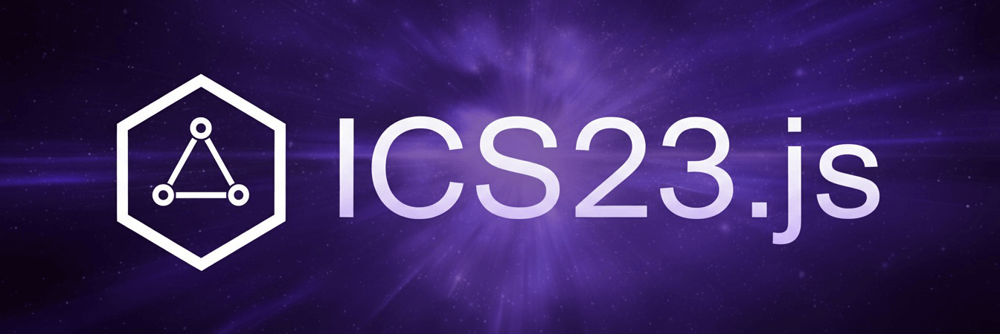

<p align="center">
  
</p>

# ICS23.js

Provides JavaScript/TypeScript bindings for the official Rust [`ics23`](https://github.com/cosmos/ics23) crate, compiled to WebAssembly via wasm-bindgen and wasm-pack. Offers a clean Node.js-ready API to verify membership or non-membership for single or batch proofs, build batch proofs, compress and decompress batch proofs, access default proof specs, and calculate existence roots.

*This project follows the removal of the TypeScript implementation - see* [PR #353](https://github.com/cosmos/ics23/pull/353).

[](https://github.com/Gldywn/ics23.js/actions/workflows/build.yml)
[](https://codecov.io/gh/Gldywn/ics23.js)
[](https://www.npmjs.com/package/@gldywn/ics23.js)
[](https://opensource.org/licenses/Apache-2.0)

## What is ICS-23?

ICS-23 is a cross-language standard for representing Merkle proofs over key-value stores. It defines a portable, unambiguous proof format that different data stores can emit and clients in different languages can verify. In the Cosmos ecosystem, it underpins light-client style verification and IBC, enabling proof of existence or non-existence of keys under a given state commitment (root). The standard targets lexicographically ordered, merklized stores (such as IAVL, Tendermint’s simple Merkle, and Sparse Merkle Trees) so new stores can be supported primarily through configuration rather than custom client code.


## Installation

```bash
npm install @gldywn/ics23.js
```

## Usage

Initialize once with `await init();` before calling other functions. The spec must match the underlying store, use the provided default for your target.

#### Single proofs
```ts
import {
  init,
  defaultIavlSpec,
  verifyMembership,
  verifyNonMembership,
  calculateExistenceRoot,
} from '@gldywn/ics23.js';

// Initialize once
await init();

// Choose the spec that matches your underlying store (e.g. IAVL, Tendermint, SMT)
const spec = defaultIavlSpec();
// const spec = defaultTendermintSpec();
// const spec = defaultSmtSpec();

// ℹ️ Proof acquisition: see "Getting proofs" section below

// Verify membership (single proof)
const okMembership = verifyMembership({
  proof, // Uint8Array (protobuf-encoded CommitmentProof)
  spec,
  root,  // Uint8Array
  key,   // Uint8Array
  value, // Uint8Array
});

// Verify non-membership (single proof)
const okNonMembership = verifyNonMembership({
  proof, // Uint8Array (protobuf-encoded CommitmentProof)
  spec,
  root,
  key,
});

// Calculate existence root from a single ExistenceProof
const rootFromProof = calculateExistenceRoot(proof);
```

#### Batch proofs
```ts
import {
  buildBatchProof,
  verifyBatchMembership,
  verifyBatchNonMembership,
  compressBatchProof,
  decompressBatchProof,
} from '@gldywn/ics23.js';

// Build a batch proof from individual CommitmentProofs
const batch = buildBatchProof([proof1, proof2, proof3]);

// Verify membership (batch proof)
const okBatchMembership = verifyBatchMembership({
  proof: batch,
  spec,
  root,
  keys: [key1, key2],
  values: [value1, value2],
});

// Verify non-membership (batch proof)
const okBatchNonMembership = verifyBatchNonMembership({
  proof: batch,
  spec,
  root,
  keys: [absentKey1, absentKey2],
});

// Compress and decompress a batch proof
const compressed = compressBatchProof(batch);
const decompressed = decompressBatchProof(compressed);
```

### Getting proofs

Use gRPC when verifying IBC state (client, connection, channel, packets). Endpoints return `ibc.core.commitment.v1.MerkleProof`, a container of ICS‑23 `CommitmentProof` entries you can pass as bytes. See proto: [commitment.proto](https://github.com/cosmos/ibc-go/blob/main/proto/ibc/core/commitment/v1/commitment.proto). Some methods: `ibc.core.client.v1.Query/ClientState`, `ibc.core.connection.v1.Query/Connection`, `ibc.core.channel.v1.Query/Channel`, `ibc.core.channel.v1.Query/PacketCommitment`.

Use CometBFT RPC for arbitrary module KV keys: call [`/abci_query?prove=true`](https://docs.cometbft.com/v0.38/rpc/#/ABCI/abci_query) (e.g., `path=/store/<store>/key`, `data=<key bytes>`, `height=H`), then convert `proofOps` to an ICS‑23 `CommitmentProof` (see conversion in ibc‑go: [utils.go](https://github.com/cosmos/ibc-go/blob/main/modules/core/23-commitment/types/utils.go)).

When you need to verify many proofs, batch client‑side before verification with `buildBatchProof`.

## Development

### Prerequisites
- Node.js v22.16+
- Rust toolchain 1.60+

### Build
```bash
npm run build:wasm    # Build Rust WASM via `wasm-pack` (./rust/pkg)
npm run build:ts      # Build TypeScript bundle via `tsup` (./dist)
npm run build         # Build WASM then TypeScript bundle
```

### Test
```bash
npm run test          # Run unit tests via `jest`
npm run test:coverage # Run unit tests via `jest` and output coverage report
```

## License

Licensed under the Apache License, Version 2.0. See `LICENSE` for details.
